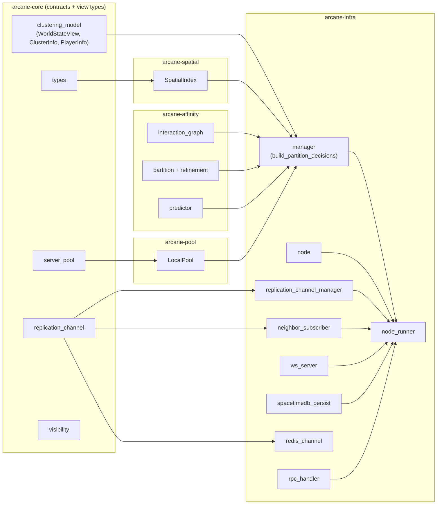

# Arcane module interactions

This document complements `SYSTEM_ARCHITECTURE.md` by focusing on crate/module boundaries inside the Rust workspace.

**Entity state and physics:** Where fields live on the wire vs in SpacetimeDB is specified in [architecture/four-bucket-state-model.md](architecture/four-bucket-state-model.md). How authoritative physics integrates with the cluster tick (including Unreal Chaos) is in [architecture/physics-backends-and-unreal.md](architecture/physics-backends-and-unreal.md).

## Workspace-level module graph

> The `world_simulator` / `IWorldSimulator` module and the `arcane-rules` crate (`RulesEngine`, the static `IClusteringModel` impl) were removed in arcane#291/#292. The clustering decision is now the in-crate global graph partition `build_partition_decisions` (`arcane-infra/src/manager.rs:122`), which consumes the interaction graph and partition/predictor modules from `arcane-affinity`. `clustering_model` in `arcane-core` retains only the view types (`WorldStateView`, `ClusterInfo`, `PlayerInfo`).

## Runtime interaction highlights

- `node_runner` is the integration point: it wires simulation (`node`), inbound neighbor replication (`neighbor_subscriber`), outbound client transport (`ws_server`), and optional persistence (`spacetimedb_persist`).
- `manager` is control-plane focused. It computes the clustering decision itself via `build_partition_decisions` (`arcane-infra/src/manager.rs:122`) over the interaction graph (`arcane-affinity`), and depends on abstractions `IServerPool` (implemented by `arcane-pool`) and `IReplicationChannel` for pool allocation and topology. The former `IClusteringModel` / `arcane-rules` seam is gone.
- `arcane-core` remains dependency-root only (no transport, I/O, or process orchestration code); its `clustering_model` module now carries only the `WorldStateView` view types the manager builds.
