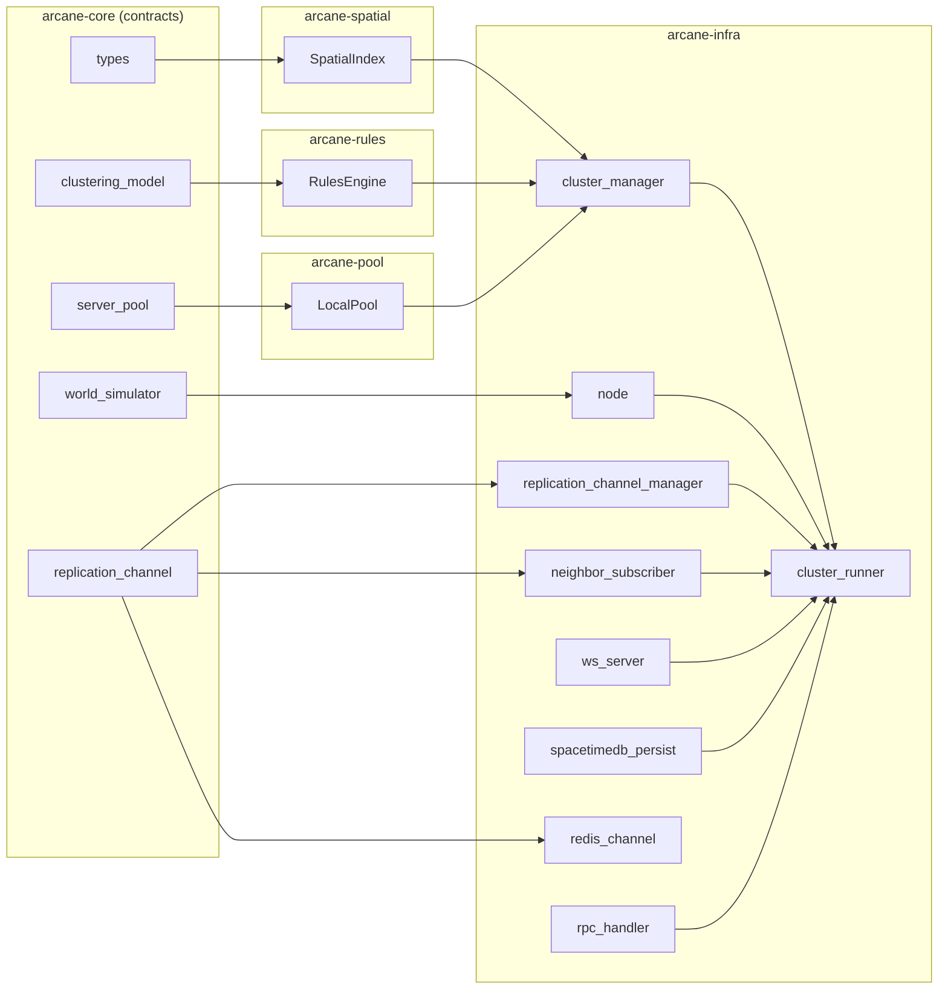

# Arcane module interactions

This document complements `SYSTEM_ARCHITECTURE.md` by focusing on crate/module boundaries inside the Rust workspace.

**Entity state and physics:** Where fields live on the wire vs in SpacetimeDB is specified in [architecture/four-bucket-state-model.md](architecture/four-bucket-state-model.md). How authoritative physics integrates with the cluster tick (including Unreal Chaos) is in [architecture/physics-backends-and-unreal.md](architecture/physics-backends-and-unreal.md).

## Workspace-level module graph

## Runtime interaction highlights

- `cluster_runner` is the integration point: it wires simulation (`node`), inbound neighbor replication (`neighbor_subscriber`), outbound client transport (`ws_server`), and optional persistence (`spacetimedb_persist`).
- `cluster_manager` is control-plane focused and depends on abstractions (`IClusteringModel`, `IServerPool`) implemented by `arcane-rules` and `arcane-pool`.
- `arcane-core` remains dependency-root only (no transport, I/O, or process orchestration code).
