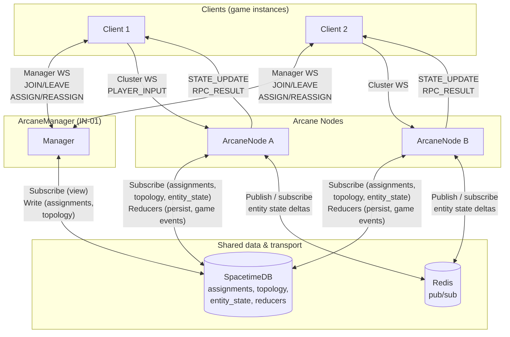
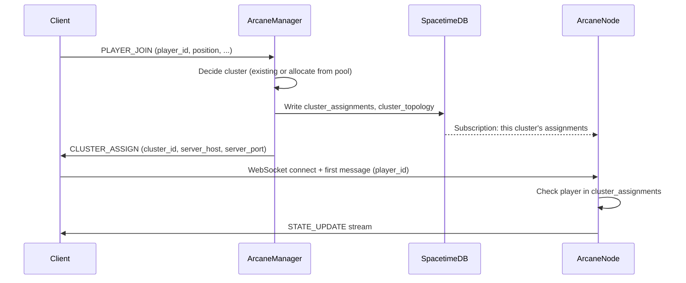
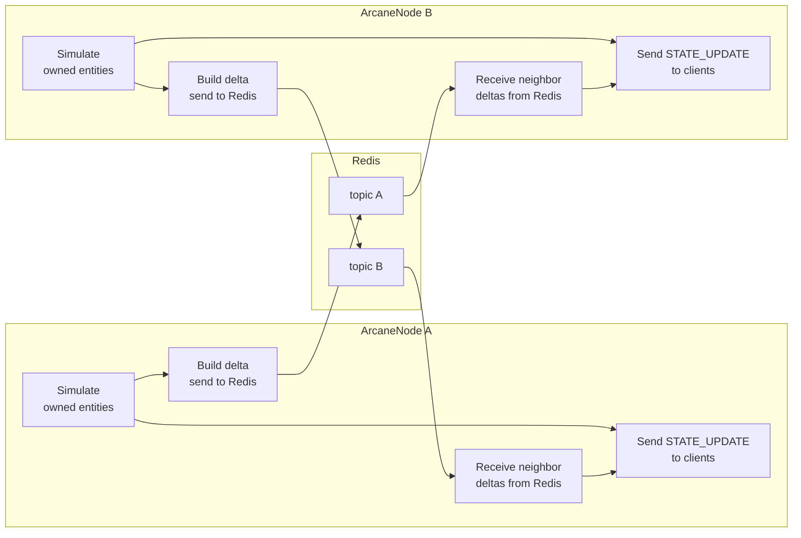

# Arcane system architecture

High-level view of how the system works, who is responsible for what, and how data moves between components. See the interface and component specs in the umbrella repo (e.g. `in_01_manager.md`, `in_02_arcane_node.md`, `in_06_replication_channel_manager.md`) for details.

---

## 1. Component overview and responsibilities



| Component | Responsibility |
|-----------|----------------|
| **Client** | Connect to Manager for join/leave and cluster assignment; connect to Arcane Node for game session; send PLAYER_INPUT; receive STATE_UPDATE, RPC_RESULT, CLUSTER_ASSIGN/REASSIGN. |
| **ArcaneManager** | Single coordinator: assign players to clusters, maintain spatial index and neighbor topology, run the clustering decision (global graph partition of the interaction graph via `build_partition_decisions`, yielding merge/split as partition changes), write assignments and topology to SpacetimeDB; send CLUSTER_ASSIGN/REASSIGN to clients. Does not simulate or replicate. |
| **ArcaneNode** | One per cluster: run simulation (movement, physics, AI) for owned entities; accept client Cluster WebSocket; send STATE_UPDATE each tick; receive PLAYER_INPUT; publish entity state to Redis for neighbors; subscribe to neighbors via Redis; read assignments/topology from SpacetimeDB; write entity state to SpacetimeDB at throttled rate; call SpacetimeDB reducers for discrete events (e.g. attack hit). |
| **ReplicationChannelManager** | Runs inside each ArcaneNode: subscribe to SpacetimeDB cluster_topology; open/close one IReplicationChannel per neighbor; deliver outbound deltas to Redis and inbound deltas from Redis to ArcaneNode. Does not decide neighbors (Manager does). |
| **Redis** | Pub/sub transport for real-time entity state between neighboring clusters. Each cluster publishes to its topic; neighbors subscribe. Fire-and-forget; no delivery guarantee. |
| **SpacetimeDB** | Authoritative store for assignments, topology, and persistent entity state. Manager writes assignments/topology; Arcane Nodes subscribe and write entity state (throttled). Reducers for discrete game events. Gap recovery uses SpacetimeDB. |

---

## 2. Data flow: join and assign



---

## 3. Data flow: simulation tick and replication



- **Per tick:** Each ArcaneNode runs simulation for its owned entities, builds one **EntityStateDelta** (batch) per tick, sends it to **all current neighbors** via ReplicationChannelManager (one publish per neighbor to Redis). It also receives deltas from neighbors (subscriptions) and merges them into a “neighbor entity” cache. STATE_UPDATE to clients includes both own entities and replicated neighbor entities.

---

## 4. Data flow: persistence and discrete events

```mermaid
flowchart TB
    subgraph ArcaneNodeProcess["ArcaneNode"]
        Tick[Simulation tick]
        Throttle[Throttled persist<br/>(e.g. every 1–2 s)]
        Event[Discrete event<br/>(e.g. hit, drop)]
    end

    subgraph SpacetimeDB
        Tables[(entity_state,<br/>assignments,<br/>topology)]
        Reducers[Reducers<br/>(persist, game events)]
    end

    Tick --> Throttle
    Tick --> Event
    Throttle -->|"Single batch<br/>(e.g. set_entities)"| Reducers
    Event -->|"Call reducer<br/>(e.g. attack_hit)"| Reducers
    Reducers --> Tables
```

- **Persistence:** ArcaneNode writes entity state to SpacetimeDB at a **throttled rate** (e.g. 1–2 s), not every tick. One batch per persist (full snapshot or ordered batch). High-frequency updates are replicated via Redis only.
- **Discrete events:** When something like “projectile hit” or “use item” happens, ArcaneNode **calls a SpacetimeDB reducer**. The reducer updates game tables and returns; ArcaneNode sends **RPC_RESULT** to the client from that return.

---

## 5. Merge/split and topology

```mermaid
sequenceDiagram
    participant M as ArcaneManager
    participant SDB as SpacetimeDB
    participant S1 as ArcaneNode A
    participant S2 as ArcaneNode B
    participant C as Client

    Note over M: Evaluation cadence: build_partition_decisions (global graph partition)
    M->>M: Merge or split decision (e.g. merge B into A)
    M->>SDB: Update cluster_assignments, cluster_topology (remove B's neighbors, etc.)
    SDB-->>S1: Subscription: topology updated (neighbors change)
    SDB-->>S2: Subscription: assignments updated (cluster dissolved)
    M->>C: CLUSTER_REASSIGN (new_cluster_id, handoff_token)
    C->>S1: HANDOFF_CLAIM (handoff_token, player_id)
    S1->>C: HANDOFF_ACCEPTED
    Note over S2: Stops; replication channels closed; pool release
```

- **ArcaneManager** is the only writer of assignments and topology. **ReplicationChannelManager** on each ArcaneNode subscribes to **cluster_topology** and opens/closes **IReplicationChannel** (Redis subscriptions) when neighbors change.

---

## 6. Summary: where data lives and who writes it

| Data | Written by | Read by | Transport / store |
|------|------------|---------|--------------------|
| Player → cluster assignment | ArcaneManager | Arcane Nodes, clients (via Manager) | SpacetimeDB |
| Cluster topology (neighbors) | ArcaneManager | ReplicationChannelManager (per node) | SpacetimeDB |
| Entity state (high-frequency) | ArcaneNode (per tick) | Neighbor Arcane Nodes | Redis (pub/sub) |
| Entity state (persistent) | ArcaneNode (throttled) | Arcane Nodes (gap recovery, load) | SpacetimeDB |
| Discrete game outcomes | ArcaneNode → reducer | Client (RPC_RESULT), SpacetimeDB tables | SpacetimeDB reducers |

For how **entity fields** map to replication vs SpacetimeDB vs process-local state, see [architecture/four-bucket-state-model.md](architecture/four-bucket-state-model.md). For **authoritative physics** (e.g. Unreal Chaos) and the cluster tick hook, see [architecture/physics-backends-and-unreal.md](architecture/physics-backends-and-unreal.md).

This document is the single place in the **arcane** library repo that describes the full system with Mermaid diagrams. For recovery (crash detection and handoff to a new instance), see GitHub issue [#3](https://github.com/brainy-bots/arcane/issues/3).
