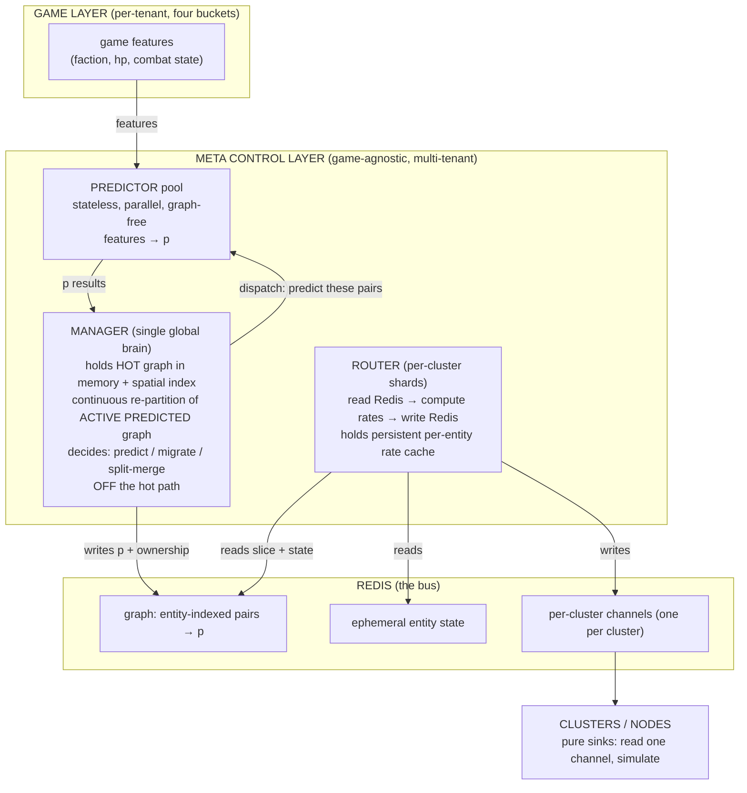

# Meta Control Layer — target architecture (interaction-driven ownership, replication, and migration)

| | |
|---|---|
| **Status** | DESIGN / TARGET (not yet implemented). Founder design conversation 2026-07-07/08. |
| **Layer** | System architecture — the game-agnostic control plane above the four-bucket game layer |
| **Supersedes intent of** | The monolithic "ArcaneManager decides everything" framing; refines Model B (`#170`) |
| **Related** | [interface-iclusteringmodel.md](interface-iclusteringmodel.md) · [clustering-system-requirements.md](clustering-system-requirements.md) · [four-bucket-state-model.md](four-bucket-state-model.md) · [adr/002-cross-cluster-physics.md](adr/002-cross-cluster-physics.md) · `arcane-arena/paper/{THESIS,CLAIMS,EXPERIMENTS}.md` · `arcane-arena/SCALING_MODEL.md` |
| **Tracking** | Initiative `arcane-clustering-physics-at-scale-demo-integration`; dev branch `initiative/meta-control-layer` |

This document is the **destination** the near-term work builds toward. It is the
full-resolution target; intermediate implementations (static frequencies, a
single manager, whole-cluster replication) are explicitly-marked stepping stones
that must remain consistent with this shape so we converge on it rather than
away from it.

---

## 0. The premise this makes concrete

The paper thesis (`arcane-arena/paper/THESIS.md`): let `p(i,j,T)` be the
probability entities `i` and `j` interact within horizon `T`. **`p` is a
sufficient statistic for every resource-allocation decision in a distributed
game backend** — replication rate, ownership/migration, and provisioning are all
`p` at different horizons under one cost objective:

```
minimize  Σ over (consumer c, entity e)  p(e,c,T)·dynamism(e)·age(c,e)
subject to per-node compute budget and per-link bandwidth budget
```

This layer is the machinery that computes `p`, turns it into per-entity
**refresh rates**, and executes the ownership changes (**live authority
migration** — a two-step "replicate then flip ownership", not a state handoff;
see §8) it implies. It is **game-agnostic and multi-tenant**: it operates
only on interaction *metadata* (who is likely to interact with whom, who owns
what, at what rate) and never reads game semantics (HP, spells, factions) except
through a pluggable feature interface at the predictor boundary.

**Why communication optimization IS computation optimization.** Better-targeted
replication → a node holds fewer proxies → it simulates/represents fewer
entities → less per-node compute. Precision of communication and minimization of
per-node compute are the same objective (`Σ F_full` in `SCALING_MODEL.md`), not
two goals. This is why the control layer matters: it is the mechanism that beats
the per-node compute wall, not a bandwidth nicety.

---

## 1. The two layers (do not conflate them)

| Layer | What it is | Tenancy | Data |
|---|---|---|---|
| **Game layer** | The four buckets — spine/pose, replicated sim payload, cluster-local, durable. Game logic, game data, game state. | Per-tenant | The actual world content |
| **Meta control layer** | Interaction-driven ownership / replication-rate / migration brain. Predictor, Manager, Router, coordinated over Redis. | Game-agnostic, multi-tenant, shared | Interaction metadata only |

The meta layer **governs how bucket data flows** (which node owns an entity's
bucket writes, at what rate bucket-1/2 data replicates) but is **not** that data.
The only component that reads game semantics is the **Predictor**, and it does so
through a per-tenant feature interface, keeping its core neutral. This separation
is what makes the control layer shared across games (multi-tenant).

---

## 2. Components (four, cleanly separated) + Redis as the bus



### 2.1 Predictor — stateless, parallel, graph-free
- Pure function: `(pair features, meta signals) → p(i,j,T)`. Inference or a
  rule-based model (MVP: heuristic `p` = distance + closing velocity + combat
  state).
- **Does not hold the graph.** The Manager decides *what* to predict and dispatches
  work ("compute `p` for these pairs, here are the features"); the predictor
  returns numbers. This is why it parallelizes trivially — no shared state, no
  coordination. Run `X` predictors; the Manager load-balances by who is free.
- Reads **both layers**: meta signals (position/velocity/history from the graph
  slice the Manager hands it) + per-tenant game features via a game-implemented
  **feature-extraction interface** (the generalization of `MergeHintSignal`).
  This is the one component that is game-aware, confined to that interface.
- **Cold-pair sweep:** the Manager also schedules a low-priority background sweep
  of *linkable* cold pairs (see §4) so discontinuous interactions (teleport,
  party-summon) are caught. Zero result costs nothing (nothing written); only a
  non-zero hit is promoted into the hot graph.

### 2.2 Manager — the single global brain (off the hot path)
- **Owns the interaction graph.** Holds the **hot** (non-zero `p`) graph in
  memory + a **spatial index** of positions. Cold pairs are offloaded to
  Redis/SpacetimeDB, not hot memory.
- **Decides what to predict** (volatility-driven; hot pairs often, cold rarely —
  the tier-3 recursion of `SCALING_MODEL.md`) and dispatches the predictor pool.
- **Continuously re-partitions the ACTIVE PREDICTED interaction graph** (§5):
  incremental frame-to-frame over changed edges, full re-cut at ~1s cadence over
  the active subgraph. Splits in-the-moment cliques by cutting on *predicted*
  future interaction, not current state.
- **Decides ownership / migration / merge / split**, writes graph + ownership to
  Redis. **Not on the per-tick router path** — routers read Redis directly, so
  the Manager is only on the write path (graph updates) and the decision path.
  If the Manager stalls, the hot path keeps running on the last-known graph.
- Single global component **by necessity** (partition decisions need a global
  view), but cheap because its work is infrequent, incremental, and on the
  aggregated cluster graph (§6). Region-shardable later using the same locality
  the game world has.

### 2.3 Router — per-cluster, `read Redis → transform → write Redis`
The Router is the data plane. It is stateless except a **persistent per-entity
rate cache**, updated whenever the Manager pushes new graph info. Sharded by
cluster (a router owns a few clusters). Its entire job, per owned cluster, per
tick:

1. Pick a cluster it owns.
2. Grab the entities in that cluster.
3. Fetch the non-zero relationships for those entities from the graph (Redis,
   entity-indexed).
4. Compute what the node actually needs — the entities it cares about and their
   **refresh rates** (full / low / zero), by evaluating the rate law against
   live state (this is where the frame-to-frame rate variation happens, locally).
5. Fetch that state metadata from Redis and write it to the cluster's **single
   channel**, with **ownership folded into the state** (each entity carries an
   owned/proxy bit).

The rate spectrum lives here. This is the actual per-cluster load-management
mechanism and the site of graceful degradation (§7).

### 2.4 Clusters / nodes — pure sinks
Clusters **never query anything.** Data flows one way: Router → cluster's
channel → cluster. A cluster reads its one channel and knows both what to
simulate authoritatively (owned) and what to represent at what rate (proxy).
One input, one direction.

### 2.5 Redis — the bus
- **Graph:** `entity-indexed pairs → p` (sparse; a router fetches "all non-zero
  edges for entity `e`" in one lookup — the graph is indexed by entity, not just
  by pair).
- **Ephemeral state:** bucket-1/2 entity metadata (the data plane; never through
  SpacetimeDB).
- **Per-cluster channels:** one inbox per cluster; the Router writes, the cluster
  reads. Stable subscription for the cluster's whole life; contents vary; no
  resubscribe churn.

### 2.6 SpacetimeDB — durable backing, not the control loop
SpacetimeDB holds durable per-tenant game state (bucket 4) and can persist the
cold-pair tail. It is **not** the live coordination medium (reducers cannot call
the external predictor model; and per-frame state must never pass through
transactional durable storage — that is the four-bucket rule). It backs, it does
not route.

---

## 3. Communication model — one channel per cluster, ownership folded into state

The system collapses to **one channel per cluster**. The cluster reads it and
gets everything: the state of the entities it should care about **and** which of
them it owns (an owned/proxy bit per entity). Attaching ownership to state is
natural because ownership is just a flag on an entity. Consequences:

- **The Manager never talks to clusters directly.** It writes ownership decisions
  where the Router reads them (Redis); the Router folds ownership into the
  per-cluster channel alongside state.
- **The Router is a pure Redis→Redis transform.** Reads graph + state, computes
  rates + ownership, writes each cluster's channel. Stateless but for its rate
  cache. Scales by cluster.
- **The cluster is a pure sink + simulator.** Read channel, compute frame.

### Why not per-entity subscriptions, per-pair channels, or a fan-out router
Explored and rejected during the design conversation:
- **Per-entity subscriptions** → one sub/query per entity + resubscribe churn as
  interest changes. Churn is expensive and unpredictable, worst during battles.
- **Per-pair / per-peer publishing** → duplicates *serialization/publish* for an
  entity wanted by many peers; overloads the hot (populous) cluster.
- **A dedicated content-based fan-out router** → its justification (one entity
  wanted by many clusters) only arises in dense cliques, which the clustering
  policy resolves by **vertical scaling** (do not split a clique) rather than
  fanning out. So the fan-out router is unnecessary.

The surviving design keeps the transport dumb (per-cluster channels) and puts
precision in **rates** (§7) and in the **clusterer** (§5), not in transport
topology.

---

## 4. Interest is a continuous rate field, truncated at zero

There is **no binary interest.** A consumer does not care about an entity or
not; it cares *at a frequency* proportional to `p·dynamism`:

```
r(e, c) = f( p(e,c,T) · dynamism(e) )   under per-consumer budget
```

- The player you are fighting: high rate. The player who might rotate to you in
  5s: low rate. The player in the next zone: ~0.
- **"Boundaries," "interest sets," and "neighbor topology" are all just the
  high-rate tail** of this continuous field. They *appear* sharp only because
  bounded MMO interaction degree makes `p` sharply peaked.
- **Truncation at zero (manager-gated).** The long tail is held at exactly zero
  (no delivery). The Manager raises an entity's rate from zero *ahead* of
  predicted interaction (the predictive tier) and lets it decay after. This keeps
  each consumer's non-zero working set small, which is what makes the whole thing
  affordable.

### Cold → hot promotion needs prediction, not geometry
Geometry alone is insufficient: teleport and party-summon make far-apart
entities interact with no spatial convergence. So promotion is **prediction-
driven**:
- **Geometry** handles spatially-converging cold pairs (spatial index surfaces
  them cheaply).
- **A predictor sweep over *linkable* cold pairs** handles discontinuous
  interaction: pairs with a latent link (same party/guild, within
  teleport/summon reach, shared quest/mechanic). This candidate set is
  `O(N × social_degree + reachable)`, i.e. ~`O(N)`, **not** `O(N²)`.
- Pairs with **neither** a spatial nor a latent link stay at zero, uncounted,
  free.
The predictor's zero-cost-on-zero property means even an over-broad sweep is
memory-safe: only hits persist.

### Rate as a law, not a per-frame value (the seam rule)
The Manager ships the Router **rate laws / coefficients** (stable, slow-changing
— they update at prediction cadence), not per-frame rate *values*. The Router
evaluates the law against live state every frame to produce the frame-to-frame
frequency. This keeps the Manager→Router control channel slow while the
per-frame variation happens locally in the Router. **Control-plane data must be
slow-changing; never per-frame.**

---

## 5. Clustering policy — pack, then re-partition the predicted graph

The clustering is **not** "many small dense clusters with occasional local
tweaks." It is:

1. **Pack maximally.** Keep as few clusters as the per-node resource budget
   allows (far-apart players cost nothing extra to co-simulate — physics
   broadphase is cheap for distant bodies; the per-actor tax is flat regardless
   of spread, and a single engine instance simulates scattered players fine
   within Large-World-Coordinates bounds). So there is **no simulation penalty**
   for co-locating non-interacting players.
2. **Re-partition the ACTIVE PREDICTED interaction graph continuously.** When a
   cluster nears its resource ceiling, cut it. The cut point is chosen by the
   interaction graph:
   - **Cheap cut (sparse seam) → split horizontally.** Bounded interaction degree
     means thin seams almost always exist, *even inside big battles* (the front
     line between flanks). A 200-player battle is **not** a clique — it is a
     bounded-degree mesh (geometry caps how many are in mutual range), so its
     min-cut severs a perimeter, not a volume. Cut cost = degree × perimeter =
     small.
   - **Expensive cut (true clique) → scale vertically.** A genuine clique is
     geometrically small (you cannot fit hundreds in mutual melee range), fits
     one node, and should get a bigger node, not a split.
3. **Split by predicted future interaction, not current state.** This is how you
   split an in-the-moment clique that is "unsplittable" now: cut along the seam
   the *next few seconds'* predicted interactions make cheapest, ride that
   partition while valid, re-cut when the prediction changes. The cut moves with
   the prediction. Pre-positions players into the right cluster *before* contact.

**The split criterion and the replication cost are the same number:** cut cost =
boundary size = replication cost. "Is this split worth it?" = "is the boundary
small enough that two nodes replicating their boundary beats one node carrying
everyone?"

Hysteresis/cooldown (already in `arcane-affinity`) rate-limits splits so they do
not thrash; `SCALING_MODEL.md`'s K_max slack (~218 boundary entities on demo
constants) means there is large tolerance before action is forced.

---

## 6. Manager scalability — memory and compute

**Memory: O(N), not O(N²).** Bounded interaction degree keeps the *hot* graph
`O(N × avg_degree)` with `avg_degree` a small constant. Cold pairs are offloaded
to Redis/SpacetimeDB; the spatial index (for convergence candidates) is `O(N)`.
The catastrophic case (N² *hot* edges = everyone mutually interacting) is
geometrically impossible. A million entities × ~100 edges is tens of GB — large,
shardable, not a wall.

**Compute: the global partitioning cost.**
- Runs at **decision cadence (seconds)**, not frame cadence — the Manager is off
  the hot path, so it has ~1s of budget, not ~16ms.
- Operates on the **active subgraph** (entities currently in / predicted into
  interaction), which is ≪ N (bounded by how many players are simultaneously in
  dense interaction — geometry-limited). "Global" means "global over the active
  set."
- Is **incremental**, not from-scratch: frame-to-frame it moves only entities
  whose optimal side flipped (`O(changed edges)`); a full re-cut runs at ~1s
  cadence as a rebalance. Full whole-graph-every-frame partitioning never
  happens (it would be too expensive).
- Global merge/split decisions use the **aggregated cluster graph** (a
  `clusters × clusters` cut-weight matrix, `O(clusters²)` — tiny), not the entity
  graph. Aggregation is incremental as `p` updates.

**When the Manager finally saturates:** region-shard it (one manager per
super-region owning that region's sub-graph, a thin top manager for the few
cross-region edges). The bounded-degree property that makes the thesis work also
makes the Manager shardable. This is a distant, planned limit — not a blocker.

**Load-bearing assumption (state explicitly):** *bounded interaction degree.* The
`O(N)` graph, bounded cluster sizes (→ bounded split cost), and bounded active
subgraph all rest on it. It holds for physical MMO combat (geometry-limited
melee/ranged). Games with global-reach mechanics (world boss everyone targets,
global AoE) locally densify the graph and strain both the Manager and the thesis
— that is the regime to validate empirically and the boundary of the claim.

**Prediction stability** is a second load-bearing requirement: incremental
re-partitioning is cheap only if the predicted graph changes smoothly
frame-to-frame. Jumpy predictions degrade incremental re-cut toward full re-cut.
Hysteresis and the prediction horizon must enforce smoothness.

---

## 7. Graceful degradation — rates absorb the manager's errors

The partition (Manager) is a **coarse** optimization; the rate spectrum (Router)
is the actual load-management mechanism, and it degrades gracefully. This makes
the Manager's imperfection harmless:

- A **partition error** (two interacting players split across clusters) becomes a
  **high refresh rate on that one cross edge** — a *bandwidth* cost, not a
  correctness failure or an overload. K_max slack means the Manager can be wrong
  about hundreds of entities before it costs a frame.
- The **10k-all-fighting** worst case: no cluster holds 10k full-fidelity
  proxies. Each cluster keeps its own players + active interactors at full rate,
  and **demotes the rest to low rate**. The clique degrades to "your own fight is
  crisp, the far side of the melee is slightly stale" — graceful, not
  catastrophic. Per-cluster load is bounded by the rate spectrum, not by the
  clique size.
- **Staleness ≠ absence.** A low-rate cross entity that unexpectedly interacts
  costs a one-frame position correction (a small pop), not a missed adjudication.
  Errors land on the least-likely interactions and are cheap when they occur.
- The **forced-clique-split at the vertical ceiling** (out of bigger hardware) is
  a rare corner — a genuine irreducible clique is geometrically small, so this is
  near-nonexistent in physical MMOs. When it happens, cut at the least-bad seam
  and replicate the (large) boundary at interaction-weighted rates; nobody is
  dropped. The ultimate defense is **predictive elasticity** (provision the big
  node *before* the clique fully forms); this degradation mode is the safety net
  for when prediction or hardware is genuinely exhausted.

**So the three mechanisms compose, each owning one regime:** cluster packing
(normal) · vertical scaling (clique with headroom) · rate-weighted degradation
(clique without headroom). The interaction graph feeds all three.

---

## 8. Live authority migration — the linchpin (paper C3, `#170`, ADR-002 Layer 3)

The whole layer's headline capability, and the one the demo (Arcane Arena) has
**never** exercised (ownership is static today).

### There is no handoff. Migration is a two-step ownership change.

**All simulation state is ephemeral** (Redis, tick by tick). A node owns exactly
the entities it writes; every other node that cares about an entity is already
**replicating it in real time from Redis**. SpacetimeDB is **never** authoritative
for a running entity — it is a throttled crash-recovery snapshot, read only at
cold restart (a full-fleet restart with no running owner). For any live entity on
a running node, SpacetimeDB is always behind and irrelevant to the hot path.

So there is **no state transfer, no snapshot, no handoff protocol.** Migration is
a **two-step operation**:

1. **Add the entity to the destination cluster's replication interest.** B starts
   receiving `e`'s state each frame — the *ordinary* interest/rate mechanism
   (§2.3, §4), not migration-specific machinery.
2. **Give the destination ownership.** A stops writing `e` at end-of-its-tick, B
   starts writing `e`. Ephemeral, via Redis. The local-wins merge dedup covers the
   one-tick overlap.

With two rules:
- **Skip step 1 if B already replicates `e`** — the common interaction-driven case.
  `e` was already high-rate to B (that is *why* it is a migration candidate), so
  migration is just step 2.
- **Require a few frames (`N`) of confirmed replication between step 1 and step 2**
  — a safety buffer so B is provably current before it takes over. This absorbs
  Redis jitter; it is a margin, not a correctness requirement.

```
migrate(e, A → B):
  if B does not already replicate e:
     add e to B's replication interest             # step 1 (reuses the interest mechanism)
     wait until B has replicated e for >= N frames  # safety buffer
  flip ownership: A stops writing e at end-of-tick, B starts   # step 2 (ephemeral, Redis)
  if e is a player: CLUSTER_REASSIGN to its client (reconnect to B)
```

### The invariant: replication always precedes ownership

The Manager **never** flips ownership to a node that is not already (or newly, via
step 1) replicating the entity. A cluster never exists without an interest list —
**starting a server means giving it a set of players to track**, and that happens
well *before* any ownership change: the server starts, begins replicating, players
receive its state each frame, and only once the Manager is sure the destination
has the entity replicated and current does ownership flip. There is no scenario —
interaction-driven or infrastructure-driven (new/empty cluster, load/spot
rebalance, whole-cluster move, split into a new node) — where the target lacks
replication at flip time, because step 1 establishes it first in every case.

This refines Model B (`#170`): merge/split is orchestrator-level (Manager decides,
Sigil provisions), and *migration itself* is just an ephemeral ownership-bit flip
on an already-replicating node — no in-process `ServerPool` shuffle (the old
`#78`-era `47ab6b0` is reference-only, do not revive), no SpacetimeDB write.
Guardrails (cooldown, rate limit, CPU cap, max in-flight) gate the flip. See the
migration executor epic (#207).

---

## 9. Cluster lifecycle (Plane 2) — orthogonal, infra-driven

Distinct from authority assignment (Plane 1, above). Create/merge/delete
clusters and place them on machines. For the demo, node count is fixed (no
Kubernetes orchestration), so Plane 2 is nearly static, with one rule honored:
**an empty cluster is a deletion candidate.** Real provisioning
(provision-on-overload, spot-aware placement) is the Sigil operator's job and a
future seam. See [clustering-system-requirements.md](clustering-system-requirements.md) §11.

### Cluster vs container vs process (refines Model B's identity collapse)
Model B (`#170`) set 1 cluster = 1 container = 1 engine process. That was priced
for engine-less Arcane; it is **too expensive once a cluster hosts a real engine**
(a UE/Godot/Rapier process is heavy). The target decouples:

```
Machine → Process (the provisioned unit) → Simulation context / engine island (1..N per process) → Cluster (logical ownership group, 1..M per context) → Entities
```

Many small clusters **pack** into one process (isolated pockets = cheap Rapier
islands / UE sublevels, not whole processes); hot clusters get their own process
for isolation + vertical scaling (the `SCALING_MODEL.md` vertical trigger).
Migration within a process is near-free (relabel in shared memory); across
processes uses the network handoff. **This reverses part of `#170` and is
architecture-affecting — it requires founder sign-off and a per-engine
feasibility note** (Rapier: trivial multi-island; UE: world-partition/sublevels
but heavy, may stay closer to 1:1). Clusters-per-process becomes an engine-tier
capability dimension.

---

## 10. Scaling profile (why this holds)

| Component | Data access | Parallelism | Rate |
|---|---|---|---|
| **Predictor** | single relationships | shard by pair/region, embarrassingly parallel | hot |
| **Router** | single relationships (its clusters' edges) | shard by cluster | hot |
| **Manager** | whole (aggregated) graph | single / region-shard later | cold, infrequent |

The two **hot** components (predictor, router) shard freely. The one **global**
component (manager) is **cold** (infrequent, incremental, aggregated view). The
thing that is hard to parallelize is also the thing you run rarely — a healthy
profile. Redis is the fan-out substrate on the hot path.

---

## 11. Intermediate implementations (the path to here)

These are stepping stones. Each must stay consistent with the target so we
converge:

1. **Live migration first** with the *dumb* transport that exists (per-cluster
   whole-cluster replication, manager-set neighbor topology, authority flip).
   Unblocks paper C3 and the product. *(Migration executor epic.)*
2. **Rate spectrum as a simple per-entity cadence knob** (heuristic `p` =
   distance + closing velocity + combat state), measured against binary AOI
   (paper C2). No SpacetimeDB brain, no self-scheduling meta-rates yet.
3. **Manager owns the graph + partition decisions** (single, in-memory, the hot
   graph). Predictor as a rule-based `p(i,j,T)` behind `arcane-affinity`'s scorer.
4. **Router as a distinct component** once whole-cluster replication is shown
   insufficient by measurement — not before. The full continuous-rate router with
   the manager/router split and the Redis-bus form is the **regime-3 / C2-full
   endpoint**, gated on measured need.

The elegance to preserve: the current per-cluster design and the target
per-entity-rate design are the **two ends of one axis** (rate granularity). The
system can be tuned along it; we start coarse and refine only where measurement
justifies it.

---

## 12. Open design points (resolve during implementation)

1. **Incremental partitioning algorithm** for the Manager's hot inner loop
   (streaming METIS variant vs KL-style local refinement touching only flipped
   entities). Its efficiency is the feasibility argument for frame-cadence
   re-cuts.
2. **Predictor sharding boundary** (region vs entity vs pair). Region is natural
   (matches clusters); cross-region pairs are the low-`p` tail.
3. **Manager region-sharding trigger** — when one machine's graph is exceeded.
4. **Cluster-per-process model per engine tier** (§9) — requires founder sign-off
   (reverses part of `#170`) and per-engine feasibility.
5. **Prediction stability enforcement** (hysteresis + horizon) as an explicit
   requirement, since incremental re-partition cost depends on it.

---

## 13. Load-bearing assumptions (the claim's boundary)

1. **Bounded interaction degree** (geometry caps mutual-interaction count). Makes
   the graph `O(N)`, cluster sizes bounded, active subgraph bounded, and cliques
   geometrically small. Holds for physical MMO combat; strained by global-reach
   mechanics. **Validate empirically.**
2. **Prediction stability** (predicted graph changes smoothly frame-to-frame).
   Makes incremental re-partition cheap. Enforced by hysteresis + horizon.
3. **Prediction lead-time > actuation latency** (thesis control-theory core). The
   Manager must warm rates/laws *ahead* of interaction so the Router always has a
   fresh-enough law; the migration warm-set must precede the flip. This is the
   C4 predictor-horizon question the paper must answer.

---

*Arcane Engine — Meta Control Layer — target architecture — Confidential*
